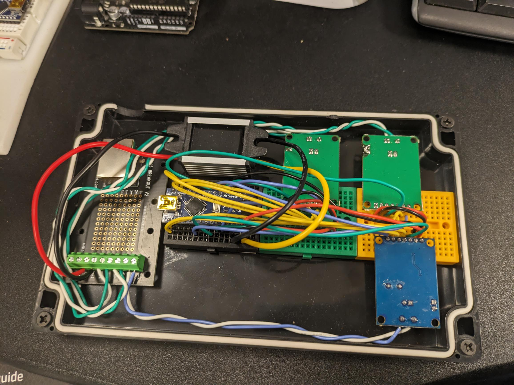
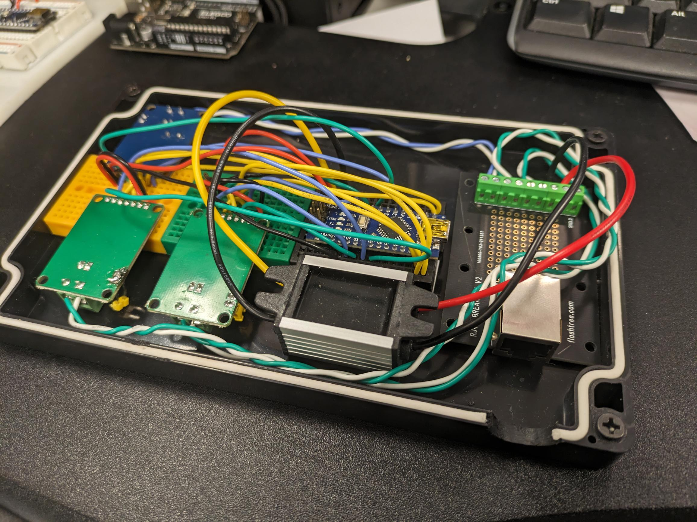

# CAN Translator
This is an Arduino based CANBUS translator for our prototype vehicle. This allows for different platforms to interface directly together. Specifically a 2019 F-650, a 2022 Transit, a 2023 F-650 and an experimental platform. 

# Wiring

# Code
The code takes input on the CAN1 interface from the BCM and remaps the signals before sending them out on the CAN0 interface to the instrument cluster.

## Input
Below is a list of messages that are filtered out and recieved. All IDs are in hex format. Details about the specific data in messages is written in code comments.

### CAN1 Body Control Module

| ID | Description |
| :---: | :--- |
| 3B2 | Contains power mode info. Used to wake up the IPC when IGN is in run |
| 3C3 | Second byte indicates brake pedal switch status |

### CAN2 Platform
//TODO

| ID | Description |
| :---: | :--- |
| 18FFE23C | Vehicle speed, SoC, gear selection, fault warnings |
| 18FF7C3C | Parking brake status |

### CAN3 Transit
//TODO

| ID | Description |
| :---: | :--- |

## Output
Below is a list of messages that are sent to the IC. All IDs are in hex format.

### CAN0 Instrument Cluster

| ID | Description |
| :---: | :--- |
| 3B3 | Power state message. Turns on the IC. |
| 3AE | Door ajar status |
| 42C | Battery light status |
| 156 | Engine temperature |
| 230 | Transmission temperature |
| 415 | ABS data |
| 420 | MIL and oil pressure status |
| 201 | Engine RPM and vehicle speed |
